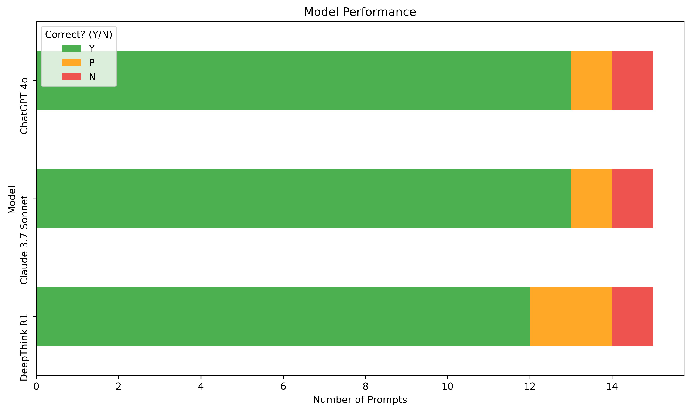
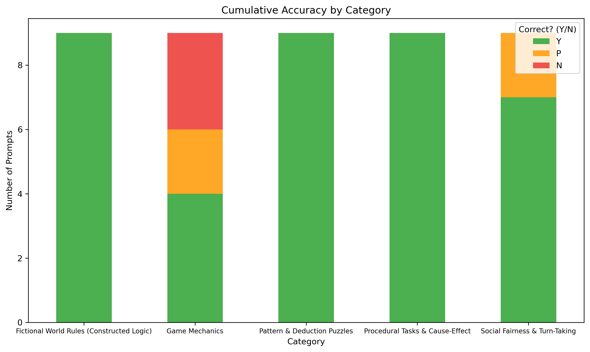
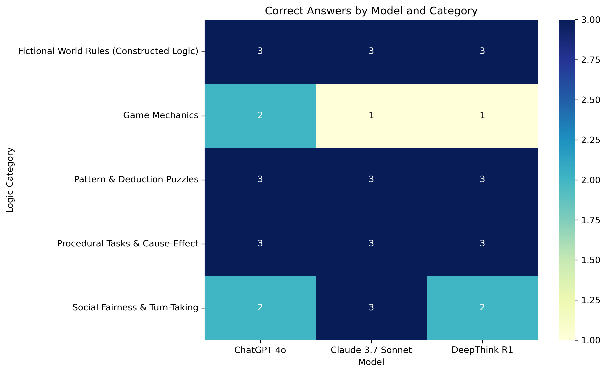

# LLM Logic Testing & Analysis
This project evaluates the logical reasoning and abstract inferencing of three of the most popular large language models (ChatGPT-4o, Claude 3.7 Sonnet, and DeepSeek R2), testing them across five different categories each with three individual prompts.

## Project Overview
Each model was given 15 prompts designed to test their ability to apply, infer, or enforce logic. Each response was collected, rated for correctness, analysed for ambiguity or inconsistency, and compared to the responses of the other models.

Prompt Categories:
  1. Game Mechanics
  2. Social Fairness & Turn-Taking
  3. Procedural Reasoning
  4. Fictional World Rules
  5. Pattern & Deduction

## Goals
- Test logical and inferential reasoning across 5 distinct categories.
- Compare model behavior in regards to fairness, puzzle solving, and real and fictional rule systems.
- Identify reasoning gaps and inference patterns.

## Sample Prompt
> "In the Jungle of Luthrain, there are always 100 golden bananas. If three are eaten, how many exist five minutes later?"
> 
> Expected: "100"
> 
> Scored: ChatGPT - Y | Claude - Y | DeepSeek - Y

## Visualizations

Here are the key results from the evaluation:

### Model Performance Breakdown

### Logic Category Breakdown

### Heatmap

## Observations
- All models performed well on structured rule-based tasks (e.g., UNO).
- For the question about cheating in **Durak**, all models chose to interpret the rules as written, with two acknowledging the informal “legal-cheating” house-rule but disregarding it.
- In the prompt **I’m Going Camping**, all three models correctly guessed that Gina’s object matched the pattern and she could go camping. However, Claude and DeepSeek used **faulty reasoning** when explaining their answer, misinterpreting the pattern entirely.
- Ambiguity in the **Basketball** prompt’s framing led to confusion regarding the focus and expected outcome of the model’s response. ChatGPT and DeepSeek chose to focus on **merit logic** instead of the intended **social fairness** (which Claude did focus on).

Overall, each model performed very well and had sound logical reasoning to back up their responses. For several prompts, they even added additional information or perspective to the situation for the user to utilize. Of the questions they got wrong, several were due to poor prompting or user knowledge, leaving only the **”I’m Going Camping”** prompt with any true failures.

## Key Takeaways
The leading language models have an excellent capacity for applying and inferring logic even in social or fictional contexts. Improving alignment requires attention to informal logic, ambiguous pattern analysis, and the narrative framing of prompts.

This project was very fun and enjoyable to work on and gave me a better understanding LLMs, data analysis, and prompt engineering. While doing this project, I felt improvement in the following skills:
- How to design, run, and score prompt-based LLM evaluations.
- How to track observations and draw comparisons.
- How to turn reasoning failures into valuable AI insights.
- Understanding the importance of clear prompt framing for value alignment.
- Data visualization with Pandas, Matplotlib, and Seaborn.

## Future Improvements
- Expand prompt types to include math, visual logic, and nested inference.
- Add more models or fine-tuned variants.
- Explore automated scoring or explainability tools.
- Create my own model to test these prompts on and adjust for performance.

## Built With
- Python, Pandas, Jupyter Notebooks, Google Sheets
- ChatGPT, Claude, DeepSeek

## Contact
Feel free to reach out or connect:
- Derek Emerson
- derekwemerson@gmail.com
- [linkedIn.com/in/derekwemerson](https://www.linkedin.com/in/derekwemerson/)
